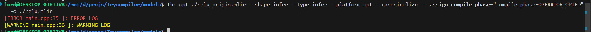
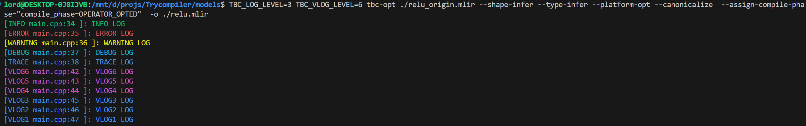
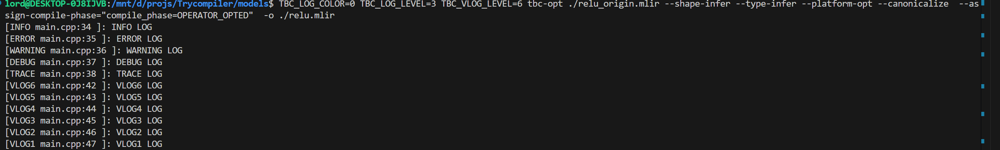

# TBC 开发文档说明

## operator dialect

## kernel dialect

## hal dialect

## LOG系统

当前有两套log系统， LOG 和VLOG，使用举例：  
```c++
int main(int argc, char **argv) {
  tbc::support::initLogger();
  LOGI<<"INFO LOG\n"; //INFO LOG
  LOGE<<"ERROR LOG\n"; //ERROR LOG
  LOGW<<"WARNING LOG\n"; //WARNING LOG
  LOGD<<"DEBUG LOG\n"; //DEBUG LOG
  LOGT<<"TRACE LOG\n"; //TRACE LOG
  //VLOGs
  VLOG(9)<<"VLOG9 LOG\n";
  VLOG(8)<<"VLOG8 LOG\n";
  VLOG(7)<<"VLOG7 LOG\n";
  VLOG(6)<<"VLOG6 LOG\n";
  VLOG(5)<<"VLOG5 LOG\n";
  VLOG(4)<<"VLOG4 LOG\n";
  VLOG(3)<<"VLOG3 LOG\n";
  VLOG(2)<<"VLOG2 LOG\n";
  VLOG(1)<<"VLOG1 LOG\n";
  ...
}
```  
正常LOG 使用 LOGx（x∈（I,E,W,D,T））,对于debug 使用VLOG，当前LOG 有5个级别（TRACE（4），DEBUG(3), WARNING(2), ERROR(1), FATAL(0)) Vlog有9 个级别。  
可以使用环境变量 `TBC_LOG_LEVEL`/`TBC_VLOG_LEVEL` 分别控制 LOG/VLOG 的输出级别，默认情况下LOG 只输出 FATAL/ERROR/WARNING， 不输出VLOG的任何log。`TBC_LOG_COLOR` 控制是否开启log颜色，默认是开启状态。
上面的例子的输出如下：  
1. 默认情况  
```bash
tbc-opt ./relu_origin.mlir --shape-infer --type-infer --platform-opt --canonicalize  --assign-compile-phase="compile_phase=OPERATOR_OPTED"
  -o ./relu.mlir
```


2. 使用环境变量控制  
```bash
TLOG_COLOR=0 TBC_LOG_LEVEL=3 TBC_VLOG_LEVEL=6 tbc-opt ./relu_origin.mlir --shape-infer --type-infer --platform-opt --canonicalize  --assig
n-compile-phase="compile_phase=OPERATOR_OPTED"  -o ./relu.mlir
```
  

3. 关闭颜色log  
```bash
TBC_LOG_COLOR=0 TBC_LOG_LEVEL=3 TBC_VLOG_LEVEL=6 tbc-opt ./relu_origin.mlir --shape-infer --type-infer --platform-opt --canonicalize  --as
sign-compile-phase="compile_phase=OPERATOR_OPTED"  -o ./relu.mlir
```



